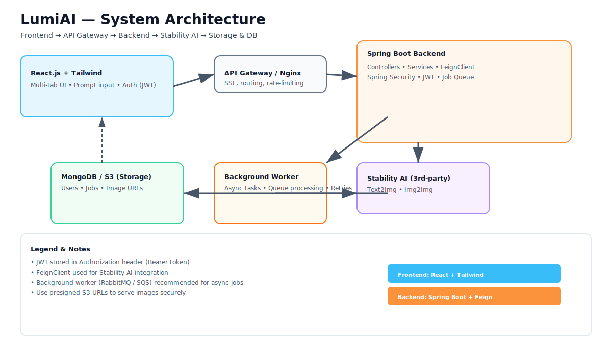

<h1 align="center">🎨 LumiAI — AI-Powered Ghibli-Style Art Generator</h1>

  
  
  
  
  

---

### 🧠 Overview  
**LumiAI** is a **full-stack AI-powered platform** that transforms your text or image prompts into **Studio Ghibli–style digital artwork**.  
Built with **Spring Boot**, **React.js**, and **Tailwind CSS**, LumiAI combines secure authentication, real-time API integration, and an elegant frontend to deliver a magical AI art experience ✨  

---

## 🚀 Features

✅ **AI Art Generation** — Convert text or image prompts into Ghibli-style artwork using **Stability AI API**.  
✅ **Secure Authentication** — JWT + Spring Security with **role-based access control** (Admin/User/Guest).  
✅ **Multi-tab Interface** — Seamless navigation between text-to-image and image-to-image tabs.  
✅ **Guest Mode** — Limited feature access for new visitors.  
✅ **Responsive Design** — Clean, mobile-friendly UI built with **React + TailwindCSS**.  
✅ **API Documentation** — All endpoints documented and validated via **Gemini API**.  
✅ **Scalability Tested** — Successfully generated 500+ AI images with optimized backend performance.  

---

## 🏗️ Architecture Overview

Below is a visual architecture diagram — it highlights the full flow from frontend to backend, background worker, external AI API, and storage.

**Quick flow:**  
Frontend (React + Tailwind) → API Gateway (Nginx) → Spring Boot Backend (JWT auth, FeignClient) → Stability AI (text2img/img2img) → Blob Storage / MongoDB. Background worker processes long-running jobs.

---

## 🛠️ Tech Stack

| Layer | Technology | Purpose |
|:------|:------------|:---------|
| Frontend | React.js, TailwindCSS | Dynamic, responsive UI |
| Backend | Spring Boot 3, FeignClient | RESTful API + Stability AI integration |
| Authentication | Spring Security, JWT | Token-based access control |
| Database | MongoDB | Store user, prompt, and image metadata |
| API Docs | Gemini API | API testing, validation, and documentation |
| Deployment | Docker, Maven, GitHub Actions | CI/CD & containerized setup |

---

## ⚙️ Installation & Setup

### 🧩 Prerequisites
- Java 17+  
- Node.js 18+  
- MongoDB (local or Atlas)  
- Stability AI Account → [https://platform.stability.ai/](https://platform.stability.ai/)  

---

### 🖥️ Backend Setup

    # 1. Clone the repo
    git clone https://github.com/<your-username>/LumiAI.git
    cd LumiAI/API
    
    # 2. Configure application.properties (or environment variables)
    # set STABILITY_API_KEY with your Stability API key
    
    # 3. Build & Run
    mvn clean install
    mvn spring-boot:run

    Backend runs at ➜ http://localhost:8080

###💻 Frontend Setup

    cd ../Frontend
    
    # 1. Install dependencies
    npm install
    
    # 2. Start the app
    npm run dev
    
    
    Frontend runs at ➜ http://localhost:5173

🧩 Example Prompts
    ✨ Calm & Cozy Studio Ambience
    
    “In a warmly lit, Ghibli-style room with wooden panels and books stacked on a desk,
    a man sits peacefully in front of a studio microphone. The atmosphere is serene and magical.”
    
    🌙 Nighttime Creative Vibe
    
    “A moody, Ghibli-inspired attic at night filled with fairy lights and records,
    a young artist recording music under the stars.”

🔐 Authentication Flow

    User logs in → Backend validates credentials.
    Backend generates JWT Token with user role (Admin/User/Guest).
    Token sent to frontend and stored in LocalStorage.
    Every API request includes token in the Authorization header.
    Spring Security verifies and grants access to protected endpoints.

🧱 API Endpoints (Sample)

      Method	Endpoint	Description
      POST	/api/auth/login	Login user and generate JWT token
      POST	/api/auth/register	Register new user
      POST	/api/generate/text	Generate image from text prompt
      POST	/api/generate/image	Generate image from uploaded image
      GET	/api/history/{userId}	Fetch user’s generation history
      
🧠 Project Learnings

    Integrated AI APIs with a real production-grade backend.
    Implemented JWT Authentication with role-based access.
    Built a multi-tab React UI optimized for UX and responsiveness.
    Learned API documentation & validation via Gemini API.
    Managed scalable performance — handled 500+ AI generations successfully.

🌍 Future Enhancements

    🚧 Add user dashboards for saved artwork
    🚧 Add subscription plans for premium users
    🚧 Integrate multiple art styles beyond Ghibli
    🚧 Deploy full stack with Docker + AWS EC2
    🚧 Add rate limiting & analytics dashboard

🧑‍💻 Author

    👨‍💻 Vairag Akbari
    📍 B.Tech CSE @ VIT Bhopal University
    💼 Full Stack Java Developer | AI Integration Enthusiast

    

🧾 License

    This project is licensed under the MIT License.
    Feel free to fork and experiment — contributions are welcome! 🤝

⭐ If you like this project, don’t forget to give it a star on GitHub!

<b>✨ Made with ❤️ by <a href="https://github.com/VairagPatel">Vairag Akbari</a> ✨</b>
 
